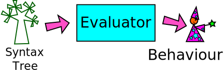
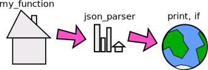

# How to write a programming language - Part 3, The Evaluator

This is the third part of our series on writing a programming language.  In
part one we broke up the code into chunks like numbers, strings and symbols
(lexing), and in part two we assembled those parts into a tree structure
(parsing).  Now we are ready to start understanding and evaluating the parts
of that tree structure to produce values and behaviour.

By the end of this article you will have seen all the most important parts
of a programming language, and be ready to write your own!

## Recap - lexing and parsing

The lexer and parser take some text like this:

    print( x + 2 );

and break it into parts, and then assemble it into a tree structure like this:

    ("call",
        ("symbol", "print"),
        [
            ("operation",
                "+",
                ("symbol", "x"),
                ("number", "2")
            )
        ]
    )

Cell is written in Python and uses Python tuples to hold all the structures it
represents.  Each tuple contains a string representing its type as the first
element, and then other information in the other elements of the tuple.

So far we have seen tuples representing tokens coming out of the lexer, and
tuples representing syntax trees coming out of the parser.  This time we will
see more tuples, representing values that have been worked out by the
evaluator.

## The evaluator calculates values

The evaluator starts at the leaves of the syntax tree and calculates the values
of the leaves, then combines together leaves and branches until it ends up with
a single value.  On the way it may have produced some side effects such as
printing something out.

## Scope

Before we look at how the evaluator works out values, we must look at the idea
of scope.  Scope describes what names can be seen where in our code.  Cell,
like almost all modern programming languages, uses "lexical" scope, which means
the values you can see are dictated by the position of the code in the text on
the screen.

So, for example, this snippet of Cell code:

    x = "World!";
    myfn = {
        x = "Hello,";
        print( x );
    };
    myfn();
    print( x );

prints:

    Hello,
    World

because the value of x inside the function myfn is set to "Hello," within
the function definition, but it reverts to "World!" in code that is outside
that block.

This more complicated example:

    outerfn = {
        x = 12;
        innerfn = {
            print(x);
        };
        innerfn;
    };

    thing = outerfn();
    thing();

prints "12" because the function innerfn carries the values it knows about with
it, meaning that when we call the function returned by outerfn(), which is
actually innerfn because that is what is returned by outerfn when we call it,
it runs the "print(x)" line and it still knows what "x" is.  Functions that are
carrying their values with them are called Closures, and the set of values
that is passed around is called an Environment.  Environments are key to the
way the evaluator works.

## Environments

An environment is a namespace that holds all the symbols that are defined in
your program.  As illustrated in figure 3, each piece of code operates inside
a local environment (such as the current function) but can also access
symbols from outer environments (such as an outer function) and the global
environment, that contains important symbols such as the "if" function.

This structure is provided in Cell by a class called Env.  It takes a parent
environment as a constructor argument, which it holds in self.parent.  To
look up a name we call the get() method:

    class Env:
        # ...
        def get(self, name):
            if name in self.items:
                return self.items[name]
            elif self.parent is not None:
                return self.parent.get(name)
            else:
                return None

This method checks whether a symbol is defined locally, and if not, it asks
the parent environment.  It gives up when it gets to the global environment,
which has None for its self.parent value.

Defining a symbol means calling set(), which is simpler:

    class Env:
        # ...
        def set(self, name, value):
            self.items[name] = value

So newly defined symbols are always defined in the local environment, and
don't leak out into wider scopes.

## The Evaluator

Listing 1 shows the main logic of the evaluator.  You can see the full code
at https://github.com/andybalaam/cell/blob/master/pycell/eval_.py , but here
we can see the main structure is very similar to the code we saw in the
previous two parts - a large if-elif block responding differently to the
various possible structures.

    Listing 1
    
    def eval_expr(expr, env):
        typ = expr[0]
        if typ == "number":
            return ("number", float(expr[1]))
        elif typ == "string":
            return ("string", expr[1])
        elif typ == "none":
            return ("none",)
        elif typ == "operation":
            return _operation(expr, env)
        elif typ == "symbol":
            name = expr[1]
            ret = env.get(name)
            if ret is None:
                raise Exception("Unknown symbol '%s'." % name)
            else:
                return ret
        elif typ == "assignment":
            var_name = expr[1][1]
            val = eval_expr(expr[2], env)
            env.set(var_name, val)
            return val
        elif typ == "call":
            return _function_call(expr, env)
        elif typ == "function":
            return ("function", expr[1], expr[2], Env(env))
        else:
            raise Exception("Unknown expression type: " + str(expr))

In the evaluator, the eval_expr() function takes in an expression to evaluate,
and the environment in which to work.  Without an environment we can't do
anything since we don't know where to look up the symbols that are being used
in the code.  The environment is an instance of the Env class we saw earlier,
and the expression is a Python tuple representing part of a syntax tree.

The first part of the tuple tells us the type of syntax tree section we have.
We place this into a variable called typ, and use it in the if block.

### Ordinary values

If we are evaluating a number, we use Python's float() function to convert the
string form that was captured in the lexer token (as expr[1], the second value
in the tuple) into a Python number.  This means we can do arithmetic with it
later if we need to, and illustrates the fact that the evaluator is where the
textual and structural forms of the code are converted in "meaning" such as
finding actual numbers and looking up the values of symbols.

If we find a string, we have very little to do, since the the value of a string
looks identical to its form as a lexer token - i.e. it is a tuple of two
values, the first of which is "string" and the second is the contents of that
string.

Next we deal with a special case - there is a special type of value in Cell
that is called None - we inject this value into the global environment with
the name None, and the Python tuple to represent its value is ("none",) i.e.
a tuple with just one value in it to represent a special none type.  In Cell,
None is used to describe a missing or empty value.  If we find a None value
like this, we simply return a similar None value from eval_expr.

The next type of syntax tree we handle is "operation" - this represents an
arithmetic operation like "+" or "*".  We call a dedicated function
_operation() to deal with this, which is shown in listing 2.

    Listing 2

    def _operation(expr, env):
        arg1 = eval_expr(expr[2], env)
        arg2 = eval_expr(expr[3], env)
        if expr[1] == "+":
            return ("number", arg1[1] + arg2[1])
        elif expr[1] == "-":
            return ("number", arg1[1] - arg2[1])
        elif expr[1] == "*":
            return ("number", arg1[1] * arg2[1])
        elif expr[1] == "/":
            return ("number", arg1[1] / arg2[1])
        else:
            raise Exception("Unknown operation: " + expr[1])

The _operation() function takes in an expression and environment just like
eval_expr, and it looks at expr[1] to find out what kind of operation is being
asked for.  As we saw in the previous article, this was populated by the parser
and can be "+", "-", "*" or "/".  In each case, we evaluate the expressions on
the left and right of the operator and place them into variables arg1 and arg2,
and then combine them together using the appropriate Python arithmetic
operator.  If the rules of arithmetic in Cell were different from those in
Python, this is where we would see the difference.  Similarly, if we chose to
use some other class to represent numbers, we would have seen that being used
when we found a "number" type, instead of the float() function.  In fact,
because Cell is designed to be simple to implement, we choose to use Python's
float type and built-in arithmetic for all the numeric operations.

Back in the main code (listing 1) we see the next type is "symbol".  This
means we found a symbol like my_function in the code, or a built-in symbol
like print or if.  To evaluate it we simply look it up in the environment
using Env's get() method that we saw earlier.  If we can't find it, we throw
an exception, producing a crude error message for the user.

Similarly, if the type is "assignment", we have found code like "x = 3", and we
use the environment's set() method to store the value inside the symbol we were
given.  We make sure to evaluate the value before storing it, by calling
eval_expr() again.  In this case, and in other cases, we call eval_expr from
inside eval_expr.  This is called recursion, and makes perfect sense if you
don't think about it too much, or, alternatively, if you think about it a lot.

### Functions

The last two types to deal with both concern functions.  First, "call" means
we are looking at a function call, something like "my_fn(3)".  We deal with
this in a separate function called _function_call, shown in listing 3.

    Listing 3

    def _function_call(expr, env):
        fn = eval_expr(expr[1], env)
        args = list((eval_expr(a, env) for a in expr[2]))
        if fn[0] == "function":
            params = fn[1]
            fail_if_wrong_number_of_args(expr[1], params, args)
            body = fn[2]
            fn_env = fn[3]
            new_env = Env(fn_env)
            for p, a in zip(params, args):
                new_env.set(p[1], a)
            return eval_list(body, new_env)
        elif fn[0] == "native":
            py_fn = fn[1]
            params = inspect.getargspec(py_fn).args
            fail_if_wrong_number_of_args(expr[1], params[1:], args)
            return fn[1](env, *args)
        else:
            raise Exception(
                "Attempted to call something that is not a function: %s" %
                str(fn)
            )

The function_call_ function (did I mention that writing a programming language
can get confusing when you start writing functions about functions, or
variables containing variables?) evaluates the function object that is being
called and checks its type.

The type will be either "function" or "native".  The "function" type means that
this is a normal function written in Cell.  In order to run it, we check we
have been given the right number of arguments, and then create a temporary
environment based on the environment carried around by the function itself
(recall the discussion of scope and closures earlier). Next it puts the
argument values into that environment using the names provided in the function
definition, and then calls eval_list.  It is not shown here, but eval_list just
evaluates each line of the function one by one.  It actually ignores the values
of all those lines except the last one, which it uses as the function's return
value.

A "native" type is a function that is not written in Cell, but instead is
provided as part of Cell's implementation.  This means the function is written
in Python (because Cell is written in Python). In this case, fn[1] is a Python
function.  We check the number of arguments again, and call the function,
passing in the environment and the arguments.  Python functions that provide
native Cell functions actually take one more argument in Python than you see in
Cell, because the first argument is the environment in which to run.  We don't
create a sub-environment in which to run in this case, because native functions
can do all kinds of magic, like modifying the environment in which they are
running.  Writing these functions is slightly odd because the arguments passed
in are tuples representing Cell values, rather than simple Python types, and
any symbols etc. need to be looked up in the environment provided.

Back in listing 1, the last type we deal with is "function".  So far we've only
dealt with calling functions, but this is about the definition of a function -
in Cell that means code inside curly braces.  In fact, most of the hard work of
defining the function has been done by the parser, which made us a list of
argument names and expressions that make up the body of the function.  All we
need to do in the evaluator is wrap all that up with a new Env object that is
the environment passed around with the function.  This means if we return a
function defintion from another function it can still access the variables it
could see when it was defined, because its environment (and the parent
environments) are held with it.  We rely on Python's object references to make
sure the values we are interested in are still available when we use them.

The else part of listing 1 throws an exception because we have found a syntax
tree that we don't recognise (in the famous last words of all programmers, this
should never happen) and we are done.

## Side effects

With all this discussion of finding values, it seems strange to say that most
programming languages, including Cell, actually do nothing with the values
they find.  In order to make a useful program, the programmer must use the
values to produce "side effects" - things that make something happen in the
world outside the program.  In Cell, we have a native function called
"print" that prints out values we have calculated.  Most other languages have
lots of available side effects such as creating and modifying files,
displaying windows, and making sounds.

## Summary

We've completed our journey: this time we saw how to take a syntax tree and
turn it into meaningful values.  When we combine this with being able to break
code into separate chunks (lexing) and building those chunks into a syntax tree
(parsing), we've covered all the basic building blocks needed to write an
interpreter.  Are you ready to design your own language?

You can find all the code for Cell at https://github.com/andybalaam/cell, and I
would to hear from you if you have made your own language - let me know through
GitHub or Twitter on @andybalaam, and check out a video series about Cell at
https://youtube.com/user/andybalaam .

