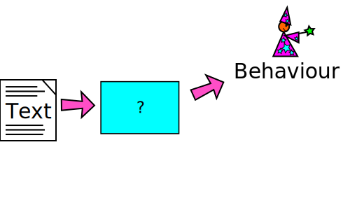
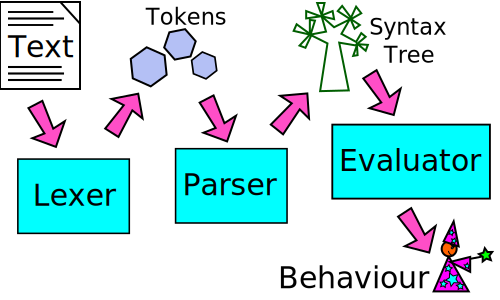

# How to write a programming language - Part 1, The Lexer

A programming language interpreter is a program that converts text (source
code) into behaviour.  Because it's a program that operates on other programs,
it can sound complicated - even something that shouldn't be attempted by mere
mortals - but really, programming languages are relatively simple programs,
often much simpler than the programs they are used to write.

In this series we will be writing an interpreter for our own programming
language, called Cell.  Cell is a proper language, with strings and numbers,
if statements, for loops, functions and things that work like objects.  If you
follow this series you will get a feel for what a programming language is, and
be ready to start designing your own!

Most programming languages are designed to make life easy for someone: usually
that person is the programmer who will be writing programs in the language.
Different languages have different designs based on the needs of that person -
for example, Python is designed to make code easy to read, and Rust is designed
to make it easy to avoid certain kinds of mistakes.

Cell is unusual because it is designed to make life easy for us: the people who
are writing it.  Lots of things about its design mean that we can write less
code when we are implementing it.  Sometimes, this will make life a bit more
difficult for the person writing programs in Cell.  We will have to live with
that: Cell is a toy language, not a hardened tool.

First, let's look at an example of a program written in Cell.

## A Cell Program

This program shows how to make variables and call functions in Cell:

    x = 3;
    y = x + 2;
    print(y);

When you run it, this program will print out the value of y, which is 5.

Cell programs should be relatively familiar to people who have used a
curly-brace language like C, C++ or Java, and also takes inspiration from
dynamic languages like Python and Ruby.  (In fact, under the covers, the
language Cell looks most like is Lisp, but its syntax is different.)

The Cell interpreter we will be writing is written in Python, which was chosen
because Python programs tend to be short and easy to read.

## How does a programming language work?

Most programming languages are built from several parts: the lexer takes in
the source code and converts it into tokens, the parser understands the
structure described by the tokens and builds them into a syntax tree, and then
the evaluator uses the syntax tree to decide what to do*.

* Of course, real languages have other parts including things like compilation,
  optimisation, and bytecode generation.

## The Lexer

In this article we will look at the lexer - the first part of our program.  The
lexer takes in text (source code) and transforms it into tokens.  Tokens are
things like a number, a string, or a name.

In Cell, the types of tokens are:

* Numbers, e.g 12 or 4.2
* Strings, e.g. "foo" or 'bar'
* Symbols, e.g. baz or qux_Quux
* Operators, e.g. + or -
* Special punctuation, including (, } and ;

So, the lexer is really just a function that takes in a string (some Cell
source code) and returns all the tokens it finds in that string.  The main
function is shown in listing 1.

    Listing 1
    
    def lex(chars_iter):
        chars = PeekableStream(chars_iter)
        while chars.next is not None:
            c = chars.move_next()
            if c in " \n":              pass           # Ignore white space
            elif c in "(){},;=:":       yield (c, "")  # Special characters
            elif c in "+-*/":           yield ("operation", c)
            elif c in ("'", '"'):       yield ("string", _scan_string(c, chars))
            elif re.match("[.0-9]", c): yield ("number", _scan(c, chars, "[.0-9]"))
            elif re.match("[_a-zA-Z]", c):
                yield ("symbol", _scan(c, chars, "[_a-zA-Z0-9]"))
            elif c == "\t": raise Exception("Tabs are not allowed in Cell.")
            else:           raise Exception("Unexpected character: '" + c + "'.")

The lex function takes in an argument called chars_iter that provides the
characters of the code we are lexing.  This can be anything that gives us
single characters if we loop through it, for example an ordinary string.  We
immediately wrap chars_iter in a PeekableStream, which is a little class
(shown in listing 2) that allows us to check one character ahead in the stream
of characters we are receiving.

    Listing 2

    class PeekableStream:

        def __init__(self, iterator):
            self.iterator = iter(iterator)
            self._fill()

        def _fill(self):
            try:
                self.next = next(self.iterator)
            except StopIteration:
                self.next = None

        def move_next(self):
            ret = self.next
            self._fill()
            return ret

The lex function returns a stream of tokens using Python's yield keyword to
provide them one by one.  Each token is a Python tuple containing two things:
a type, which tells us what kind of token we are dealing with, and the value,
which is the contents of the token (for example, a number, a string, or the
name of a variable).

The main body of the lex function is a while loop stepping through the
characters one by one, and for each one doing something based on what type of
character it is.  When we are in this part of the code, we know we are looking
for the beginning of a new token, and the first character of that token will
help us decide what type of token it is.

The first line of the if allows us to skip over any white space (spaces or
newlines) we find.  The second line identifies any special characters.  The
values yielded by the lex function are pairs that look like (TYPE, VALUE), for
example ("string", "Hello") would represent a string token that contains the
word "Hello".  The special characters are slightly different - we treat each
character as a unique type, so when we find a ";" character, we yield (";",
"").  This means the parser (which we will see in the next article in this
series) can treat each special character differently.  Because in Cell special
characters are always exactly one character long, we can immediately yield a
token when we find one.

The next part (elif c in "+-*/") identifies arithmetic operations.  Again,
these tokens are always one character long, so we can immediately yield a token
with type "operation", and value the actual symbol the user typed.

Now we move on to more interesting tokens.  If the first character of a token
is a single or double quote, we know we are dealing with a string.  We must
scan forwards through the characters until we find a matching close quote,
and then yield a token with type string.  To scan forwards we call the function
_scan_string, which is shown in listing 3.

    Listing 3
    
    def _scan_string(delim, chars):
        ret = ""
        while chars.next != delim:
            c = chars.move_next()
            if c is None:
                raise Exception("A string ran off the end of the program.")
            ret += c
        chars.move_next()
        return ret

_scan_string moves through the characters of the string, and stops when it
reaches a matching quote.  The characters between the quotes are returned, and
this is the value of the token that is yielded from the lex function.  Unlike
most programming languages, Cell does not provide a way of "escaping" a quote
symbol by writing \" or similar.  This is a limitation we have chosen to
accept to keep our lexer simple.

Continuing through the big if/elif block in the lex function (listing 1), next
we come to numbers.  The first character in a number will always be a number
or a decimal point, so when we see one of those we call the _scan function,
telling it to keep consuming characters while it can see numbers or decimal
points.  The _scan function is shown in listing 4

    Listing 4
    
    def _scan(first_char, chars, allowed):
        ret = first_char
        p = chars.next
        while p is not None and re.match(allowed, p):
            ret += chars.move_next()
            p = chars.next
        return ret

_scan is similar to _scan_string, but instead of continuing until it reaches a
closing quote, it continues reading characters until it finds one that is not
allowed.  It uses a regular expression to handle this, and for a number, the
regular expression is [.0-9], which just means only numbers and decimal points
are allowed.  Notice that "0.4.3" would count as a number here, or even "....".
It would certainly be nice to tell the programmer that they made a mistake like
this, but we don't necessarily need to do this in the lexer - we might choose
to check this in the parser, or in a later validation stage.

The next elif in the lex function (listing 1) checks for a symbol like a
variable name.  These must start with a letter or an underscore.  Once we have
found a letter or an underscore, we call the _scan function again, and the
characters that are allowed include numbers as well as letters and underscores.
Notice that at this point, the lexer does not care at all whether this is a
variable name, a function name, or something else.  In fact it doesn't even
care whether you are allowed to write a symbol at this point in the program -
all it cares about is that the characters it found make a symbol.  It's the
parser's job to care about what is allowed where.

It is common in lots of programming languages to allow numbers in symbols, but
not for the first character.  If you ever wondered why that is, this might
help to explain - by disallowing numbers as the first character, we make it
easy for the lexer to tell the difference between numbers and symbols, without
having to scan through the whole token first.

The last two branches of the if/elif structure in the lex function handle tab
characters (which are simply never allowed in Cell programs) and anything else
that was unexpected.  Both of these produce (fairly unhelpful) error messages.

We have now talked about the entire source code of Cell's lexer - that is all
there is, so if you understand it, you have a good chance of understanding the
lexer in your favourite programming language, or of writing your own.

## Summary

Lexers do a very simple job: read in the text version of a program, and break
up the parts of it into separate tokens that make sense to the next part: the
parser.

Next time, we'll look at Cell's parser, and how it takes in tokens and arranges
them into a tree shape reflecting the actual structure of the instructions we
are giving to the computer.  After that we'll look at how the evaluator turns
that tree into actual behaviour, making a real, working programming language.
